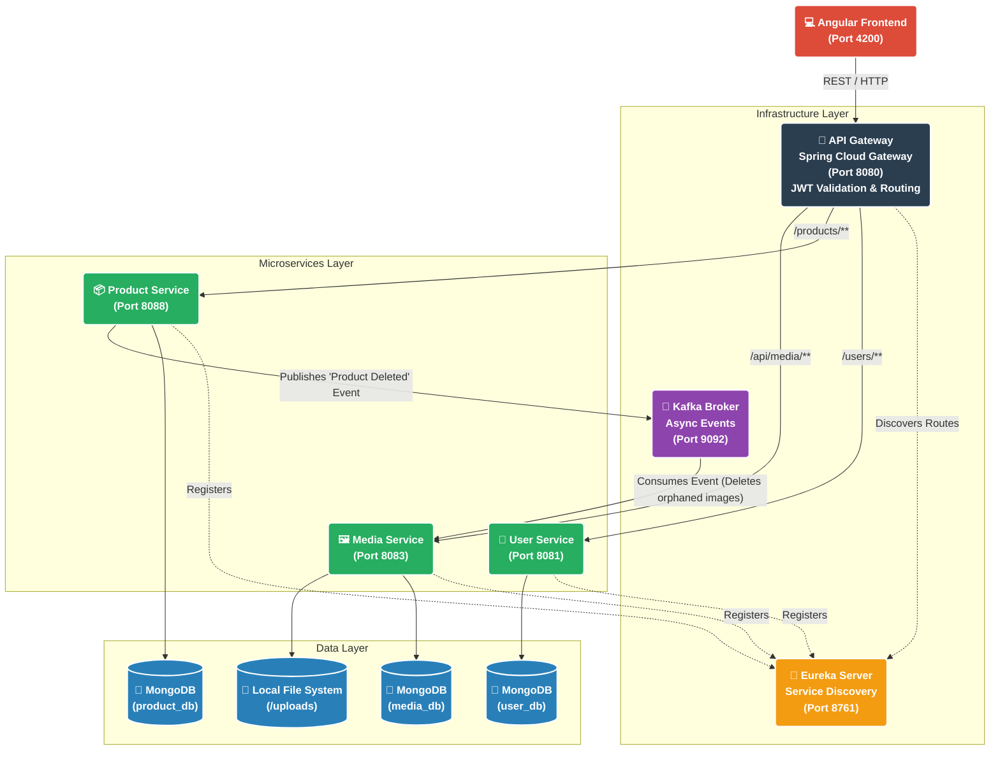

```mermaid
graph TD
    %% Define Styles
    classDef client fill:#dd4b39,stroke:#fff,stroke-width:2px,color:#fff,font-weight:bold;
    classDef gateway fill:#2b3e50,stroke:#fff,stroke-width:2px,color:#fff,font-weight:bold;
    classDef registry fill:#f39c12,stroke:#fff,stroke-width:2px,color:#fff,font-weight:bold;
    classDef service fill:#27ae60,stroke:#fff,stroke-width:2px,color:#fff,font-weight:bold;
    classDef database fill:#2980b9,stroke:#fff,stroke-width:2px,color:#fff,font-weight:bold;
    classDef broker fill:#8e44ad,stroke:#fff,stroke-width:2px,color:#fff,font-weight:bold;

    %% Nodes
    Client("💻 Angular Frontend<br>(Port 4200)"):::client

    subgraph "Infrastructure Layer"
        Gateway("🚪 API Gateway<br>Spring Cloud Gateway<br>(Port 8080)<br>JWT Validation & Routing"):::gateway
        Eureka("📍 Eureka Server<br>Service Discovery<br>(Port 8761)"):::registry
        Kafka("📨 Kafka Broker<br>Async Events<br>(Port 9092)"):::broker
    end

    subgraph "Microservices Layer"
        UserSvc("👤 User Service<br>(Port 8081)"):::service
        ProdSvc("📦 Product Service<br>(Port 8088)"):::service
        MediaSvc("🖼️ Media Service<br>(Port 8083)"):::service
    end

    subgraph "Data Layer"
        UserDB[("🍃 MongoDB<br>(user_db)")]:::database
        ProdDB[("🍃 MongoDB<br>(product_db)")]:::database
        MediaDB[("🍃 MongoDB<br>(media_db)")]:::database
        Disk[("📁 Local File System<br>(/uploads)")]:::database
    end

    %% Flow/Connections
    Client -- "REST / HTTP" --> Gateway
    
    %% Eureka Registration
    Gateway -. "Discovers Routes" .-> Eureka
    UserSvc -. "Registers" .-> Eureka
    ProdSvc -. "Registers" .-> Eureka
    MediaSvc -. "Registers" .-> Eureka

    %% Gateway Routing
    Gateway -- "/users/**" --> UserSvc
    Gateway -- "/products/**" --> ProdSvc
    Gateway -- "/api/media/**" --> MediaSvc

    %% Database Connections
    UserSvc --> UserDB
    ProdSvc --> ProdDB
    MediaSvc --> MediaDB
    MediaSvc --> Disk

    %% Async Communication
    ProdSvc -- "Publishes 'Product Deleted' Event" --> Kafka
    Kafka -- "Consumes Event (Deletes orphaned images)" --> MediaSvc
```