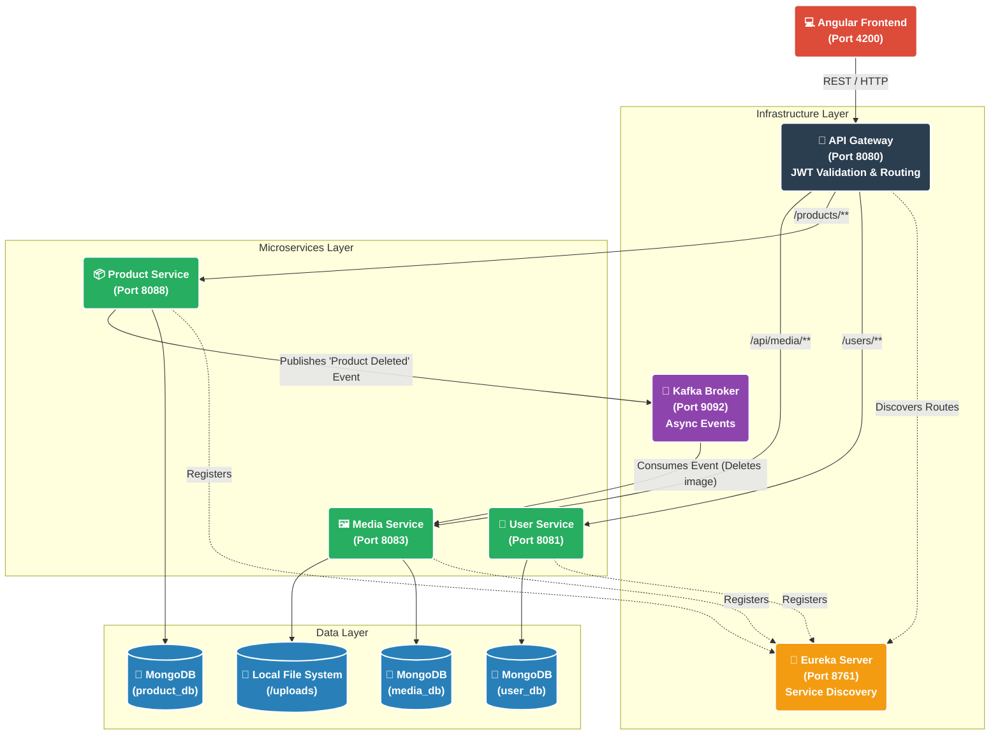

---

# 🛒 01buy - Enterprise E-Commerce Backend

A robust, highly scalable, and event-driven backend for the **01buy** e-commerce platform. Built on a modern microservices architecture using Spring Boot 3, Spring Cloud, Apache Kafka, and MongoDB.

## 🏗️ System Architecture

The backend is composed of decoupled microservices, each with a single responsibility. They communicate synchronously via an API Gateway and asynchronously via Apache Kafka.



## 🛠️ Tech Stack

* **Core Framework:** Java 21, Spring Boot 3.3.6
* **Cloud/Routing:** Spring Cloud Gateway, Netflix Eureka
* **Databases:** MongoDB
* **Message Broker:** Apache Kafka & Zookeeper
* **Security:** Spring Security, stateless JWT (JSON Web Tokens)
* **Documentation:** Springdoc OpenAPI (Swagger UI)
* **Containerization:** Docker & Docker Compose

## 📦 Microservices Breakdown

1. **Discovery Server (`8761`):** The Netflix Eureka service registry. All other services register here so the Gateway can dynamically route traffic without hardcoded IP addresses.
2. **API Gateway (`8080`):** The single entry point for the frontend. Handles CORS, blocks unauthorized requests by verifying JWT signatures, and acts as a reverse proxy for the centralized Swagger documentation hub.
3. **User Service (`8081`):** Manages user registration, login, profile management, and JWT generation. Also serves as the UI host for the centralized Swagger Hub.
4. **Product Service (`8088`):** Handles all e-commerce product listings (CRUD). Checks ownership permissions and triggers Kafka events upon product deletion.
5. **Media Service (`8083`):** A decoupled file-storage engine. Handles uploading, deep-sniffing file types, and serving images. It lacks a `DELETE` API endpoint by design, relying entirely on Kafka events to securely clean up orphaned files.

## 🚀 Getting Started

### Prerequisites

* **Java 21** installed locally.
* **Maven** installed locally.
* **Docker & Docker Compose** installed and running.

### Step 1: Start Infrastructure (Databases & Kafka)

Before starting the Java applications, spin up the required databases and event brokers using Docker.

```bash
# Navigate to the project root containing docker-compose.yml
docker compose up -d

```

*(This starts MongoDB, Mongo Express, Zookeeper, and Kafka).*

### Step 2: Run the Microservices

A bash script is provided to quickly boot up the entire ecosystem in the correct order.

```bash
# Make the script executable (first time only)
chmod +x start.sh

# Start the ecosystem
./start.sh

```

## 📖 API Documentation (Swagger)

We use a Centralized Swagger Hub. You do not need to visit each microservice individually to view its documentation.

Once all services are running, navigate to:
👉 **http://localhost:8080/swagger-ui.html**

Use the **"Select a definition"** dropdown in the top right corner to instantly switch between the API docs for the User, Product, and Media services.

## ⚡ Event-Driven Design Highlight

To maximize performance and decoupling, the `Media Service` does not share a database with the `Product Service`.
When a user deletes a product:

1. The `Product Service` instantly deletes the DB record and publishes the `mediaId` to the `product-deletion-topic` on Kafka. It immediately returns a `204 No Content` to the user.
2. The `Media Service` consumes the message in the background and safely deletes the physical file from the server's hard drive.
*Benefit: Lightning-fast API response times, no dropped HTTP calls, and a highly secure media system that cannot be manipulated via external REST requests.*

## 🛑 Stopping the Application

* If running via `quick-run.sh`, simply press `Ctrl+C` in the terminal to kill all Java processes.
* To shut down the Docker infrastructure:

```bash
docker compose down

```

---

That should render perfectly in your GitHub repo or Markdown editor! Does the image generate correctly for you now?